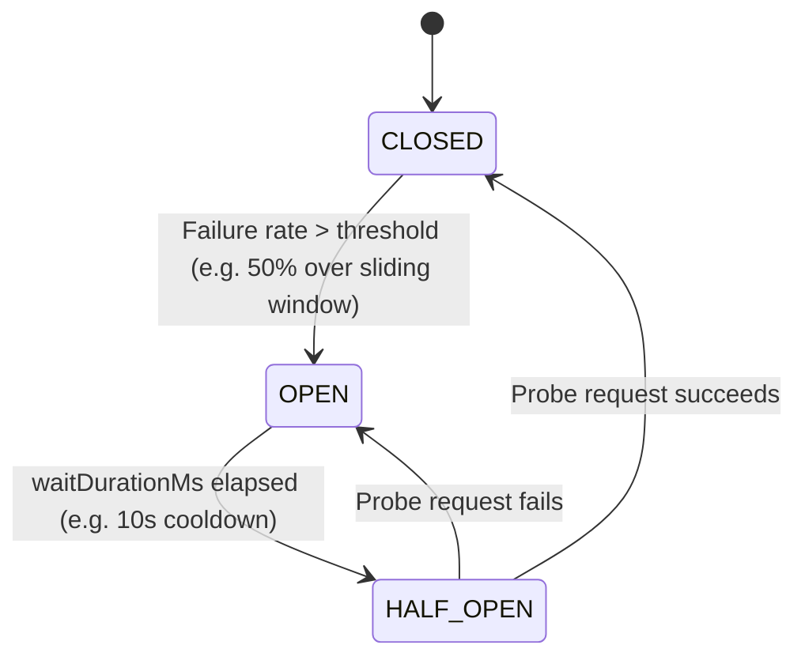

# 🏛️ PulseGate Architecture Deep-Dive

PulseGate is a reactive, distributed API gateway designed for high-throughput microservice ecosystems. It runs on **Spring WebFlux (Project Reactor / Netty)**, providing non-blocking I/O across all layers: HTTP routing, Redis operations, Kafka analytics streaming, and reactive database persistence.

---

## 1. High-Level System Architecture

```
                       ┌────────────────────────────────────────┐
                       │          Client (HTTP/HTTPS)           │
                       └───────────────────┬────────────────────┘
                                           │
                                           ▼
                       ┌────────────────────────────────────────┐
                       │      Ingress / Load Balancer (K8s)     │
                       └───────────────────┬────────────────────┘
                                           │
             ┌─────────────────────────────┼─────────────────────────────┐
             ▼                             ▼                             ▼
    ┌─────────────────┐           ┌─────────────────┐           ┌─────────────────┐
    │ PulseGate Pod 1 │           │ PulseGate Pod 2 │           │ PulseGate Pod N │
    └────────┬────────┘           └────────┬────────┘           └────────┬────────┘
             │                             │                             │
             └──────────────────────┬──────┴─────────────────────────────┘
                                    │
       ┌────────────────────────────┼────────────────────────────┐
       ▼                            ▼                            ▼
┌──────────────┐             ┌──────────────┐             ┌──────────────┐
│   Redis 7    │             │  PostgreSQL  │             │ Apache Kafka │
│ (Lua Scripts │             │   (R2DBC)    │             │  (Analytics  │
│  & Pub/Sub)  │             │ Route Store  │             │   Stream)    │
└──────────────┘             └──────────────┘             └──────────────┘
```

---

## 2. Request Lifecycle & Filter Pipeline

Each request arriving at PulseGate traverses an ordered, non-blocking filter pipeline before reaching the upstream microservice:

```
[Inbound Request]
       │
       ▼
1. CorrelationIdFilter (Order: 10)
   ├── Extracts or generates UUID correlation ID
   └── Sets Reactor Context & MDC logging header
       │
       ▼
2. RateLimitFilter (Order: 20)
   ├── Resolves client identity (API Key / Client IP)
   ├── Selects rate limit policy (Token Bucket / Sliding Window / Fixed Window)
   ├── Executes atomic Lua script in Redis
   └── If quota exceeded: Short-circuits with HTTP 429 + Retry-After headers
       │
       ▼
3. CircuitBreakerFilter (Order: 30)
   ├── Checks state machine (CLOSED / OPEN / HALF_OPEN)
   ├── If OPEN: Fast-fails with HTTP 503 Service Unavailable
   └── If HALF_OPEN: Emits single probe request
       │
       ▼
4. Upstream Forwarding (WebClient / Netty Client)
   ├── Non-blocking HTTP request to upstream service
   └── Measures response status & execution latency
       │
       ▼
5. RequestLoggingFilter (Order: 100)
   ├── Records total latency, bytes transferred, HTTP status
   ├── Emits async RequestEvent to Apache Kafka topic: `pulsegate-requests`
   └── Increments Prometheus/Micrometer latency counters
       │
       ▼
[Outbound Response to Client]
```

---

## 3. Distributed Rate Limiting via Atomic Redis Lua Scripts

PulseGate supports three distinct rate limiting algorithms, executed entirely on the Redis engine to guarantee consistency across multi-replica gateway clusters:

### A. Token Bucket Algorithm
- **Best for:** Bursty client traffic (mobile apps, customer dashboards).
- **Mechanism:** Tokens accumulate at a steady replenishment rate up to bucket capacity. Requests consume 1 token.
- **Lua Atomicity:** Calculates elapsed time since last request, recalculates current tokens, decrements, and updates Redis hash in a single atomic script.

### B. Sliding Window Counter
- **Best for:** Strict regulatory compliance, payment gateways, and SMS OTP endpoints.
- **Mechanism:** Maintains a Redis Sorted Set (`ZSET`) where scores and members are epoch millisecond timestamps. 
- **Lua Atomicity:** Removes timestamps older than `(now - window_size)`, counts remaining elements with `ZCARD`, and allows request if `count < limit`.

### C. Fixed Window Counter
- **Best for:** Free-tier rate limiting and daily API quotas.
- **Mechanism:** Keys prefixed with epoch window (`api:client:window`). Uses atomic `INCR` and `EXPIRE`.

---

## 4. Adaptive Circuit Breaker State Machine

PulseGate features an autonomous circuit breaker that prevents cascading upstream microservice failure:



- **Distributed State Consensus:** Circuit breaker states and metrics are synchronized via Redis and broadcast across nodes using Redis Pub/Sub.
- **Real-Time WebSocket Feed:** State transition events are published over WebSockets to connected operations consoles at `/ws/circuit-breaker`.

---

## 5. Memory Management & Zero-Downtime Route Invalidation

- **RouteCache:** Routes are stored in PostgreSQL but kept in-memory in a high-speed `ConcurrentHashMap` with pre-compiled regex route matchers.
- **Pub/Sub Invalidation:** When routes or policies are updated via the REST admin API, an invalidation message is published to the Redis topic `pulsegate:route:invalidate`. All running gateway pods refresh the target route within < 100ms.
